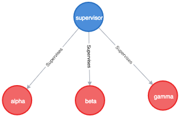

class: middle, center

# Supervision trees in Erlang

School of Erlang

---
# Supervisor

This behavior module provides a supervisor,
a process that supervises other processes called child processes.
A child process can either be another supervisor or a worker process.

The supervisor is responsible for starting, stopping, and monitoring its child processes.
The basic idea of a supervisor is that it must keep its child processes alive by restarting them when necessary.

See the docs [here](https://erlang.org/doc/man/supervisor.html) and [here](https://erlang.org/doc/design_principles/sup_princ.html).

---
# Supervisor Flags  - _strategy_

 - **one_for_one** - If one child process terminates and is to be restarted, only that child process is affected. This is the default restart strategy.

 - **one_for_all** - If one child process terminates and is to be restarted, all other child processes are terminated and then all child processes are restarted.

 - **rest_for_one** - If one child process terminates and is to be restarted, the 'rest' of the child processes (that is, the child processes after the terminated child process in the start order) are terminated. Then the terminated child process and all child processes after it are restarted.

 - **simple_one_for_one** - A simplified one_for_one supervisor, where all child processes are dynamically added instances of the same process type, that is, running the same code.

---
# _rest_for_one_ - Example

```erlang

init(_Args) ->
    SupFlags = #{strategy => rest_for_one, ...},

    ChildSpecAlpha = #{id => alpha, start => {m, start_link, []},
    ChildSpecBeta = #{id => beta, start => {m, start_link, []},
    ChildSpecGamma = #{id => gamma, start => {m, start_link, []},
    % ChildSpecs is a list !!!
    ChildSpecs = [ChildSpecAlpha, ChildSpecBeta, ChildSpecGamma],
    {ok, {SupFlags, ChildSpecs}}.

```

.center[  ]

When _beta_ worker dies, worker _gamma_ is terminated.
Then workers _beta_ and _gamma_ are restarted.

---
# Supervisor Flags  - _intensity_ and _period_

The supervisors have a built-in mechanism to limit the number of restarts which can occur in a given time interval.
This is specified by the two keys _intensity_ and _period_ in the supervisor flags map returned by the callback function _init_.

```erlang
SupFlags = #{ intensity => MaxR, period => MaxT, ...},
```

If more than _MaxR_ number of restarts occur in the last _MaxT_ seconds,
the supervisor terminates all the child processes and then itself.
The termination reason for the supervisor itself in that case will be shutdown.

The keys _intensity_ and _period_ are optional in the supervisor flags map.
The defaults are:

```erlang
#{intensity => 1, period => 5}
```

[Read the docs](http://erlang.org/doc/design_principles/sup_princ.html#max_intensity)

---
# Child Specification

```erlang
child_spec() = #{id => child_id(),       % mandatory
                 start => mfargs(),      % mandatory
                 restart => restart(),   % optional
                 shutdown => shutdown(), % optional
                 type => worker(),       % optional
                 modules => modules()}   % optional
```
[Read the ](https://erlang.org/doc/design_principles/sup_princ.html#child-specification)

---
# Child Specification - id

The _id_ key is mandatory.
_id_ is used to identify the child specification internally by the supervisor.
It is unique across this supervisors children.

---
# Child Specification - start

_start_ defines the function call used to start the child process.
It is a module-function-arguments tuple used as _apply(Module, Function, Arguments)_.

In a supervisor we have:
```erlang
...
start => {pgsql_backend, start_link, [db_worker_name]},
...
```
and in the _auth_ module:

```erlang
-module(auth).

-export([start_link/1]).

start_link(Name) ->
    gen_server:start_link({local, Name}, auth, [], []).
```

---
# Supervisor Example

```erlang
-module(app_sup).
-behaviour(supervisor).

-export([start_link/0, init/1]).

start_link() ->
    supervisor:start_link(app_sup, []).

init(_Args) ->
    SupFlags = #{
        strategy => one_for_one,
        intensity => 1,
        period => 5
    },
    ChildSpecs = [#{
        id => auth,
        start => {auth, start_link, []}
    }],
    {ok, {SupFlags, ChildSpecs}}.
```

---
# Read more

[supervisor module](http://erlang.org/doc/man/supervisor.html)

[supervision principles](http://erlang.org/doc/design_principles/sup_princ.html)
